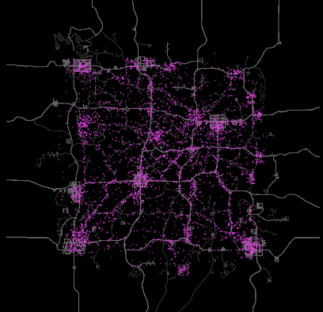

# City Migrators

<div style="text-align: center;" markdown>

</div>

Agents spawn in cities and travel between them using roads. The **CityVisitor** processor gives each agent a destination city — larger cities are more likely to be chosen. Once an agent arrives, it explores for a while before picking a new destination and heading out again.

**StickToRoads** keeps agents on the road network during travel. Combined with alignment and separation, groups move together along roads in loose formations. **WorldEvents** ensures agents still react to player-generated sounds like gunshots and explosions.

## Key Processors

| Parameter | Value | Why |
|---|---|---|
| CityVisitor Power | 0.9 | Strong pull toward destination city |
| CityVisitor Param1 | 15 | Minimum stay time in a city (minutes) |
| CityVisitor Param2 | 30 | Maximum stay time in a city (minutes) |
| StickToRoads Power | 0.5 | Moderate road adherence — agents follow roads but can deviate slightly |
| AgentStartPosition | RandomCity | Agents begin inside cities rather than scattered across the map |
| WorldEvents Power | 0.7 | Agents react to player sounds — slightly lower than other presets so road/city navigation stays dominant |

## Configuration

[Download XML](city-migrators.xml){ .md-button download="City Migrators.xml" }

```xml
<?xml version="1.0" encoding="utf-8"?>
<WalkerSim xmlns:xsi="http://www.w3.org/2001/XMLSchema-instance" xmlns:xsd="http://www.w3.org/2001/XMLSchema" xsi:schemaLocation="http://zeh.matt/WalkerSim WalkerSimSchema.xsd" xmlns="http://zeh.matt/WalkerSim">
  <Logging>
    <General>false</General>
    <Spawns>false</Spawns>
    <Despawns>false</Despawns>
    <EntityClassSelection>false</EntityClassSelection>
    <Events>false</Events>
  </Logging>
  <RandomSeed>901234</RandomSeed>
  <PopulationDensity>140</PopulationDensity>
  <SpawnActivationRadius>96</SpawnActivationRadius>
  <StartAgentsGrouped>true</StartAgentsGrouped>
  <EnhancedSoundAwareness>true</EnhancedSoundAwareness>
  <SoundDistanceScale>1</SoundDistanceScale>
  <FastForwardAtStart>true</FastForwardAtStart>
  <GroupSize>16</GroupSize>
  <AgentStartPosition>RandomCity</AgentStartPosition>
  <AgentRespawnPosition>RandomBorderLocation</AgentRespawnPosition>
  <PauseDuringBloodmoon>true</PauseDuringBloodmoon>
  <SpawnProtectionTime>300</SpawnProtectionTime>
  <InfiniteZombieLifetime>false</InfiniteZombieLifetime>
  <MaxSpawnedZombies>75%</MaxSpawnedZombies>
  <MovementProcessors>
    <ProcessorGroup Name="System 1" Group="-1" SpeedScale="1" PostSpawnBehavior="Wander" PostSpawnWanderSpeed="Walk" Color="#DD44DD">
      <Processor Type="CityVisitor" Distance="0" Power="0.9" Param1="15" Param2="30" />
      <Processor Type="StickToRoads" Distance="0" Power="0.5" Param1="0" Param2="0" />
      <Processor Type="AlignSameGroup" Distance="20" Power="0.6" Param1="0" Param2="0" />
      <Processor Type="AvoidSameGroup" Distance="10" Power="1" Param1="0" Param2="0" />
      <Processor Type="WorldEvents" Distance="0" Power="0.7" Param1="0" Param2="0" />
    </ProcessorGroup>
  </MovementProcessors>
</WalkerSim>
```
