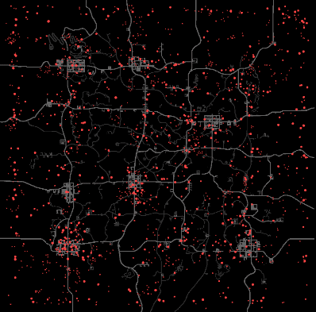

# Classic Boids

<div style="text-align: center;" markdown>

</div>

This preset uses the three classic [boid](https://en.wikipedia.org/wiki/Boids) rules to create natural-looking flocking behavior:

- **FlockSameGroup** (cohesion) — agents steer toward the center of nearby group members
- **AlignSameGroup** (alignment) — agents match the heading of nearby group members
- **AvoidSameGroup** (separation) — agents steer away from group members that are too close

Wind provides a gentle drift so groups migrate across the map over time, and WorldEvents lets agents react to sounds.

## Key Processors

| Parameter | Value | Why |
|---|---|---|
| FlockSameGroup Distance | 30 | Medium cohesion range keeps groups together without clumping |
| AlignSameGroup Distance | 25 | Slightly smaller than flock range so alignment kicks in before attraction |
| AvoidSameGroup Distance | 8 | Short range prevents overlapping without breaking formations |
| AvoidSameGroup Power | 1.2 | Strongest processor — separation always wins at close range |
| Wind Power | 0.5 | Gentle push so groups drift without overriding flock behavior |
| WorldEvents Power | 0.8 | Agents react strongly to player-generated sounds like gunshots and explosions |

## Configuration

[Download XML](classic-boids.xml){ .md-button download="Classic Boids.xml" }

```xml
<?xml version="1.0" encoding="utf-8"?>
<WalkerSim xmlns:xsi="http://www.w3.org/2001/XMLSchema-instance" xmlns:xsd="http://www.w3.org/2001/XMLSchema" xsi:schemaLocation="http://zeh.matt/WalkerSim WalkerSimSchema.xsd" xmlns="http://zeh.matt/WalkerSim">
  <Logging>
    <General>false</General>
    <Spawns>false</Spawns>
    <Despawns>false</Despawns>
    <EntityClassSelection>false</EntityClassSelection>
    <Events>false</Events>
  </Logging>
  <RandomSeed>123456</RandomSeed>
  <PopulationDensity>140</PopulationDensity>
  <SpawnActivationRadius>96</SpawnActivationRadius>
  <StartAgentsGrouped>true</StartAgentsGrouped>
  <EnhancedSoundAwareness>true</EnhancedSoundAwareness>
  <SoundDistanceScale>1</SoundDistanceScale>
  <GroupSize>16</GroupSize>
  <AgentStartPosition>Mixed</AgentStartPosition>
  <AgentRespawnPosition>RandomBorderLocation</AgentRespawnPosition>
  <PauseDuringBloodmoon>true</PauseDuringBloodmoon>
  <SpawnProtectionTime>300</SpawnProtectionTime>
  <InfiniteZombieLifetime>false</InfiniteZombieLifetime>
  <MaxSpawnedZombies>75%</MaxSpawnedZombies>
  <Systems>
    <System Name="System 1" Weight="1" SpeedScale="1" PostSpawnBehavior="Wander" PostSpawnWanderSpeed="Walk" Color="#FF4444">
      <Processor Type="FlockSameGroup" Distance="30" Power="0.8" Param1="0" Param2="0" />
      <Processor Type="AlignSameGroup" Distance="25" Power="1" Param1="0" Param2="0" />
      <Processor Type="AvoidSameGroup" Distance="8" Power="1.2" Param1="0" Param2="0" />
      <Processor Type="Wind" Distance="0" Power="0.5" Param1="0" Param2="0" />
      <Processor Type="WorldEvents" Distance="0" Power="0.8" Param1="0" Param2="0" />
    </System>
  </Systems>
</WalkerSim>
```
