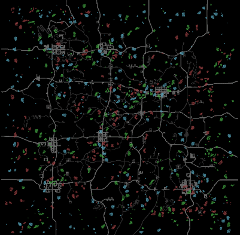

# Loose Swarm

<div style="text-align: center;" markdown>

</div>

Three independent groups drift across the map in different patterns. Each group uses very low flocking power with high avoidance, creating loose clouds of agents that spread out rather than clump together.

The groups move in different directions:

- **System 1** (green) — follows the wind
- **System 2** (red) — moves against the wind
- **System 3** (blue) — moves against the wind at reduced power, creating a slower diagonal drift

All three groups use **AvoidOtherGroup** to keep distance from each other, so they occupy different parts of the map.

## Key Processors

| Parameter | Value | Why |
|---|---|---|
| SpeedScale | 0.8 | Slower movement for a more ambient feel |
| FlockSameGroup Power | 0.03 | Very weak cohesion — groups barely hold together |
| AvoidSameGroup Distance | 20 | Large avoidance range spreads agents out |
| AvoidSameGroup Power | 0.8 | Strong separation keeps agents well-spaced |
| AvoidOtherGroup Power | 0.0001 | Subtle inter-group repulsion over long distances |
| Wind / WindInverted | varies | Different wind responses push groups in opposing directions |
| WorldEvents Power | 0.6 | Agents react to player sounds — moderate so swarm drift isn't completely overridden |

## Configuration

[Download XML](loose-swarm.xml){ .md-button download="Loose Swarm.xml" }

```xml
<?xml version="1.0" encoding="utf-8"?>
<WalkerSim xmlns:xsi="http://www.w3.org/2001/XMLSchema-instance" xmlns:xsd="http://www.w3.org/2001/XMLSchema" xsi:schemaLocation="http://zeh.matt/WalkerSim WalkerSimSchema.xsd" xmlns="http://zeh.matt/WalkerSim">
  <Logging>
    <General>false</General>
    <Spawns>false</Spawns>
    <Despawns>false</Despawns>
    <EntityClassSelection>false</EntityClassSelection>
    <Events>false</Events>
  </Logging>
  <RandomSeed>789012</RandomSeed>
  <PopulationDensity>140</PopulationDensity>
  <SpawnActivationRadius>96</SpawnActivationRadius>
  <StartAgentsGrouped>true</StartAgentsGrouped>
  <EnhancedSoundAwareness>true</EnhancedSoundAwareness>
  <SoundDistanceScale>1</SoundDistanceScale>
  <FastForwardAtStart>true</FastForwardAtStart>
  <GroupSize>16</GroupSize>
  <AgentStartPosition>Mixed</AgentStartPosition>
  <AgentRespawnPosition>RandomBorderLocation</AgentRespawnPosition>
  <PauseDuringBloodmoon>true</PauseDuringBloodmoon>
  <SpawnProtectionTime>300</SpawnProtectionTime>
  <InfiniteZombieLifetime>false</InfiniteZombieLifetime>
  <MaxSpawnedZombies>75%</MaxSpawnedZombies>
  <Systems>
    <System Name="System 1" Weight="1" SpeedScale="0.8" PostSpawnBehavior="Wander" PostSpawnWanderSpeed="Walk" Color="#44AA44">
      <Processor Type="FlockSameGroup" Distance="40" Power="0.03" Param1="0" Param2="0" />
      <Processor Type="AlignSameGroup" Distance="15" Power="0.3" Param1="0" Param2="0" />
      <Processor Type="AvoidSameGroup" Distance="20" Power="0.8" Param1="0" Param2="0" />
      <Processor Type="Wind" Distance="0" Power="0.7" Param1="0" Param2="0" />
      <Processor Type="WorldEvents" Distance="0" Power="0.6" Param1="0" Param2="0" />
      <Processor Type="AvoidOtherGroup" Distance="50" Power="0.0001" Param1="0" Param2="0" />
    </System>
    <System Name="System 2" Weight="1" SpeedScale="0.8" PostSpawnBehavior="Wander" PostSpawnWanderSpeed="Walk" Color="#9E4244">
      <Processor Type="FlockSameGroup" Distance="40" Power="0.03" Param1="0" Param2="0" />
      <Processor Type="AlignSameGroup" Distance="15" Power="0.3" Param1="0" Param2="0" />
      <Processor Type="AvoidSameGroup" Distance="20" Power="0.8" Param1="0" Param2="0" />
      <Processor Type="WindInverted" Distance="0" Power="0.7" Param1="0" Param2="0" />
      <Processor Type="WorldEvents" Distance="0" Power="0.6" Param1="0" Param2="0" />
      <Processor Type="AvoidOtherGroup" Distance="50" Power="0.0001" Param1="0" Param2="0" />
    </System>
    <System Name="System 3" Weight="1" SpeedScale="0.8" PostSpawnBehavior="Wander" PostSpawnWanderSpeed="Walk" Color="#57A8BF">
      <Processor Type="FlockSameGroup" Distance="40" Power="0.03" Param1="0" Param2="0" />
      <Processor Type="AlignSameGroup" Distance="15" Power="0.3" Param1="0" Param2="0" />
      <Processor Type="AvoidSameGroup" Distance="20" Power="0.8" Param1="0" Param2="0" />
      <Processor Type="WindInverted" Distance="0" Power="0.2" Param1="0" Param2="0" />
      <Processor Type="WorldEvents" Distance="0" Power="0.6" Param1="0" Param2="0" />
      <Processor Type="AvoidOtherGroup" Distance="50" Power="0.0001" Param1="0" Param2="0" />
    </System>
  </Systems>
</WalkerSim>
```
