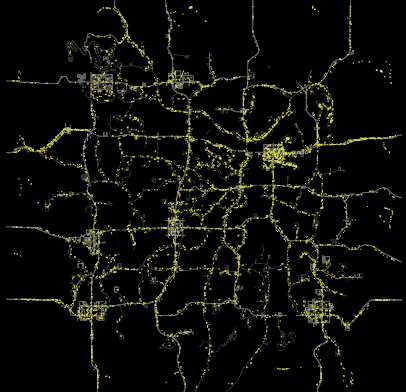

# Road Horde

<div style="text-align: center;" markdown>

</div>

Agents spawn in cities and march along roads in tight formations. **StickToRoads** at full power is the dominant processor, keeping agents locked to the road network. Flocking and alignment make them move together as a cohesive horde, while a small avoidance distance prevents them from stacking on top of each other.

Wind provides a directional bias so hordes tend to travel in one direction rather than milling around.

## Key Processors

| Parameter | Value | Why |
|---|---|---|
| SpeedScale | 1.2 | Faster than default for an aggressive marching feel |
| StickToRoads Power | 1 | Maximum road adherence — agents stay locked to road nodes |
| AlignSameGroup Power | 0.8 | Strong alignment keeps the horde moving as a unit |
| AvoidSameGroup Distance | 6 | Tight spacing — agents stay close but don't overlap |
| FlockSameGroup Distance | 20 | Short flock range keeps sub-groups together on the road |
| Wind Power | 0.4 | Mild directional bias without overpowering road navigation |
| AgentStartPosition | RandomCity | Agents begin in cities and immediately start traveling roads |
| WorldEvents Power | 0.8 | Strong reaction to player sounds — hordes will divert toward gunshots and explosions |

## Configuration

[Download XML](road-horde.xml){ .md-button download="Road Horde.xml" }

```xml
<?xml version="1.0" encoding="utf-8"?>
<WalkerSim xmlns:xsi="http://www.w3.org/2001/XMLSchema-instance" xmlns:xsd="http://www.w3.org/2001/XMLSchema" xsi:schemaLocation="http://zeh.matt/WalkerSim WalkerSimSchema.xsd" xmlns="http://zeh.matt/WalkerSim">
  <Logging>
    <General>false</General>
    <Spawns>false</Spawns>
    <Despawns>false</Despawns>
    <EntityClassSelection>false</EntityClassSelection>
    <Events>false</Events>
  </Logging>
  <RandomSeed>345678</RandomSeed>
  <PopulationDensity>140</PopulationDensity>
  <SpawnActivationRadius>96</SpawnActivationRadius>
  <StartAgentsGrouped>true</StartAgentsGrouped>
  <EnhancedSoundAwareness>true</EnhancedSoundAwareness>
  <SoundDistanceScale>1</SoundDistanceScale>
  <FastForwardAtStart>true</FastForwardAtStart>
  <GroupSize>16</GroupSize>
  <AgentStartPosition>RandomCity</AgentStartPosition>
  <AgentRespawnPosition>RandomBorderLocation</AgentRespawnPosition>
  <PauseDuringBloodmoon>true</PauseDuringBloodmoon>
  <SpawnProtectionTime>300</SpawnProtectionTime>
  <InfiniteZombieLifetime>false</InfiniteZombieLifetime>
  <MaxSpawnedZombies>75%</MaxSpawnedZombies>
  <MovementProcessors>
    <ProcessorGroup Name="System 1" Group="-1" SpeedScale="1.2" PostSpawnBehavior="Wander" PostSpawnWanderSpeed="Walk" Color="#DDDD44">
      <Processor Type="StickToRoads" Distance="0" Power="1" Param1="0" Param2="0" />
      <Processor Type="FlockSameGroup" Distance="20" Power="0.3" Param1="0" Param2="0" />
      <Processor Type="AlignSameGroup" Distance="20" Power="0.8" Param1="0" Param2="0" />
      <Processor Type="AvoidSameGroup" Distance="6" Power="1" Param1="0" Param2="0" />
      <Processor Type="Wind" Distance="0" Power="0.4" Param1="0" Param2="0" />
      <Processor Type="WorldEvents" Distance="0" Power="0.8" Param1="0" Param2="0" />
    </ProcessorGroup>
  </MovementProcessors>
</WalkerSim>
```
