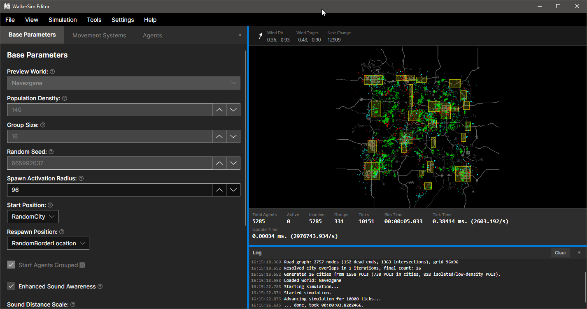

# Editor Tool

The Editor is a standalone program that lets you test and set up the mod **outside of the game**. It simulates the zombie movement on your computer so you can see how your settings will work before using them in 7 Days to Die.

The Editor does NOT require the game to be running - it's a standalone preview tool.

## Download

As of version 1.1, the Editor is no longer included with the mod and must be downloaded separately from the [releases page](https://github.com/ZehMatt/7dtd-WalkerSim2/releases). Download the appropriate version for your platform:

- **Windows**: `WalkerSim2-Editor-Windows-x64-{version}.zip`
- **macOS**: `WalkerSim2-Editor-Mac-arm64-{version}.zip`
- **Linux**: `WalkerSim2-Editor-Linux-x64-{version}.zip`

Extract the zip file and run the Editor executable.

---

## Working With Configuration Files

### Loading a Configuration

To load an existing configuration file:

1. Click `File` > `Load Configuration`
2. Browse to your config file (usually `WalkerSim.xml`)
3. The Editor will load all your settings

Common locations to load from:

- `Mods/WalkerSim2/WalkerSim.xml` (the default mod config)
- `<7 Days to Die>\Data\Worlds\<World>\WalkerSim.xml` (world-specific config)
- `%APPDATA%\GeneratedWorlds\<Your World>\WalkerSim.xml` (generated world config)

!!! tip "Try the example configurations"
    Download any of the [example configurations](configuration/examples/index.md) and load them directly into the Editor to see different movement behaviors in action. This is a great way to understand how processors interact before building your own setup.

### Saving Your Configuration

Once you're happy with your setup, you must save it to use in the game:

1. Click `File` > `Save Configuration`
2. Choose where to save it:
    - Save to `Mods/WalkerSim2/WalkerSim.xml` to use for all worlds
    - Save to your world folder to use for one specific world only
3. Click Save

**Important**: The Editor only previews your settings. You must save to use them in the game!

### Saving and Loading Simulation States

The simulation state (`.bin` files) contains all zombie positions, health, and current behaviors. These files are automatically created by the mod when the game is running.

**In the Game:**

- The mod automatically saves the simulation state every 60 seconds to `walkersim.bin` in your world's save folder
- This preserves all zombie data when you exit the game
- When you reload the world, the mod loads this file so zombies continue from where they were

**In the Editor:**

You can load these game-generated state files to test from a specific point:

- **Load State**: `Simulation` > `State` > `Load State` - Loads a `walkersim.bin` file from a game save
- **Save State**: `Simulation` > `State` > `Save State` - Saves the current editor simulation to a `.bin` file

This is useful for:

- Testing how your configuration changes affect an existing game save
- Debugging specific situations that happened in your game
- Continuing editor work from where you left off

!!! note
    State files include zombie positions and the configuration that was active when saved. The world size must match or the state cannot be loaded.

---

## Main Settings

### World

Pick a map to preview. This loads the map so you can see where zombies will go. The map choice is not saved - it's just for testing.

### Other Settings

Most settings here match the settings from the [Base Parameters](configuration/base.md) page. Click on any setting to see what it does.

## Movement Systems and Processors

This section lets you set up [Movement Systems](configuration/systems.md) and [Processors](configuration/processors.md).

You can:

- Create groups of zombies with different behaviors
- Set how fast each group moves
- Choose what zombies do when they spawn
- Add behaviors like "stick to roads" or "chase loud noises"

---

## Display Options

The `View` menu controls what is drawn on the map and how the camera behaves. These only affect the preview display, not the simulation or your saved configuration.

- `Zoom` > `Reset` / `In` / `Out` (also `Ctrl +` and `Ctrl -`)
- `Pause Rendering` freezes drawing while the simulation keeps running
- Layer toggles: `Biomes`, `Roads`, `Road Network`, `Cities`, `Prefabs`, `Inactive Agents`, `Active Agents`, `Events`

---

## Testing Your Setup

### Starting the Preview

1. Click `Simulation` > `Start` (or press `F5`) to begin
2. Watch zombies move around on the map
3. You can change settings while it's running (some settings need a restart)

`Simulation` > `Stop` (or `Shift+F5`) stops the preview, and `Simulation` > `Reset` resets the simulation back to its initial state.

### Speed Controls

Use `Simulation` > `Speed` to change how fast the preview runs: `1x`, `2x`, `64x`, `128x`, or `256x`. Higher multipliers fast-forward the simulation so you can quickly observe long-term behavior such as the population ramp, respawns, and city migration. `Simulation` > `Advance One Tick` (or `F7`) steps the simulation forward a single tick, useful for inspecting movement closely.

!!! note
    Very fast speeds might not be accurate. After speeding up, slow back down to normal speed and let it run for a bit to see the real behavior.

---

## Tools

The `Tools` menu interacts with the running preview. For the location based tools, pick the option from the menu and then click on the map.

### Emit Sound

`Tools` > `Emit Sound` > (distance) creates a noise of the chosen radius at the spot you click. This tests if zombies move toward loud sounds (needs a sound-aware processor such as `WorldEvents`).

- The circle shows how far the sound travels
- Zombies should start walking toward it

### Kill

`Tools` > `Kill...` kills all zombies in a circle where you click. This tests if zombies come back (respawn) properly.

- The circle shows which zombies will die
- Watch to see if/where new zombies appear

### Players

Spawning and despawning happen around players, so you need at least one player to preview spawn behavior.

- `Tools` > `Add Player` adds a player to the simulation. Add more than one to test multiplayer spawning.
- Once a player exists, a `Players` submenu lists each one. For any player choose:
    - `Change Location`, then click on the map to move that player
    - `Remove` to delete that player from the simulation

---

## Preferences

`Settings` > `Preferences...` opens the Editor preferences:

- **Theme**: Changes the appearance of the Editor
- **Pan Button** / **Zoom Modifier**: Which mouse button pans the map view and which modifier key is used for zooming
- **User Data Folder**: Overrides where the Editor looks for game data such as generated worlds. Only set this if you launch the game with `-userdatafolder=<path>`, the default is `%APPDATA%/7DaysToDie`
- **Detected Game Folders**: Game installations auto-detected from Steam and the registry, these are always scanned for worlds
- **Additional Game Folders**: Extra folders to scan for worlds, useful for custom install locations

---

## Summary

1. **Load** a configuration to start with (or use the default)
2. **Adjust** settings and test with the preview
3. **Save** your configuration when you're happy with it
4. Put the saved file in your mod or world folder
5. Launch 7 Days to Die to use your settings

The Editor is just for testing - always remember to save your configuration!
