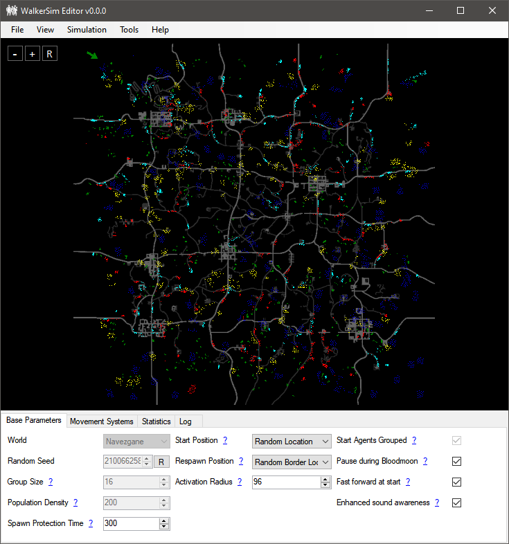

# WalkerSim Editor

The **WalkerSim Editor** provides a user-friendly interface for setting up and customizing the simulation. It enables you to test and visualize the simulation outside the game environment, allowing you to preview how your settings will perform before integrating them into gameplay.

## Base Parameters

The `World` setting is not saved in the configuration file. It loads a map for preview purposes and calculates the number of agents based on the map's size and the configured population density.

Other settings align with the XML schema. For more details, refer to [Base Parameters](configuration/base.md).

## Movement Processors

This section allows you to configure [Groups](configuration/grouping.md) and [Movement Processors](configuration/processors.md).

---

## Simulation

### Starting the Simulation.

Once your configuration is complete, you can launch the simulation by navigating to `Simulation` > `Start`. Starting the simulation resets the state. You can also modify parameters while the simulation is active, though some settings that require a restart will be disabled.

### Simulating at Higher Speeds

The Editor supports increasing the simulation's timescale to accelerate testing.

!!! note
    Higher speeds may reduce accuracy. For best results, return to normal speed after fast-forwarding and let the simulation run briefly to stabilize.

---

### Tools

The tools allow you manipulate the active simulation by clicking on the preview once the tool is selected.

#### `Emit Sound`

Simulates a basic sound event in the simulation, this can test the [world events](configuration/processors.md#16-worldevents) processor, select the `Emit Sound` tool and click anywhere in the preview, it should show 
the radius while the tool is selected.

#### `Kill`

Kills all the agents within the radius, this can test the [respawn behavior](configuration/base.md#7-agentrespawnposition), select the `Kill` tool and click anywhere in the preview, it should show 
the radius while the tool is selected.