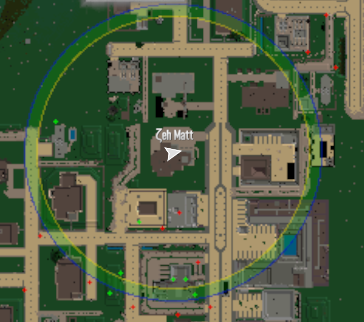

# Frequently Asked Questions

## Is This a Server Mod?

Yes. The mod runs on the server side. This means:

- Install it on servers
- Players joining don't need to install anything

## Will this influence the game performance/FPS?

No. The simulation runs in the background and is quite well optimized, you should not notice any difference.

## When I host this on a server will the clients need the mod?

No. Only the server needs the mod.

## When Do Zombies Appear?

When you get close to a virtual zombie, it appears in your game as a real zombie you can see and fight.

<figure markdown="1">

</figure>

The picture above shows how this works. Virtual zombies walk around in a circle around you. When they cross into the colored ring near the edge, they become real zombies in your game.

The zombie that appears matches your area:

- Desert zombies in the desert
- Snow zombies in the snow
- Uses the game's normal zombie spawn rules

!!! note "Important"
    There is no guarantee that zombies will spawn when they enter the activation zone. If the virtual zombie's location is inside a POI or otherwise obstructed, the spawn will not occur and the zombie will continue advancing in the simulation as a virtual agent.

## When Do Zombies Disappear?

When zombies walk too far away from you, they turn back into virtual zombies. The mod remembers:

- How much health they had
- What type of zombie they were

So if that same zombie comes back later, it will still be hurt if you damaged it before.

## When Do Zombies Respawn?

Zombies will only truly respawn if they are killed.

## Where Do Zombies Respawn?

Where zombies respawn in the simulation depends on the configuration, see [AgentRespawnPosition](configuring/configuration/base.md#agentrrespawnposition).

## Will I Have to Keep the Editor Running?

No. The Editor is a tool to help create a configuration and export it to the xml.

## Does This Change Animals?

No. Animals work exactly the same as in the normal game.

## What About Blood Moon?

You can choose in the settings. By default, the mod stops during Blood Moon nights so the normal Blood Moon zombies work as usual, see [PauseDuringBloodmoon](configuring/configuration/base.md#pauseduringbloodmoon).
