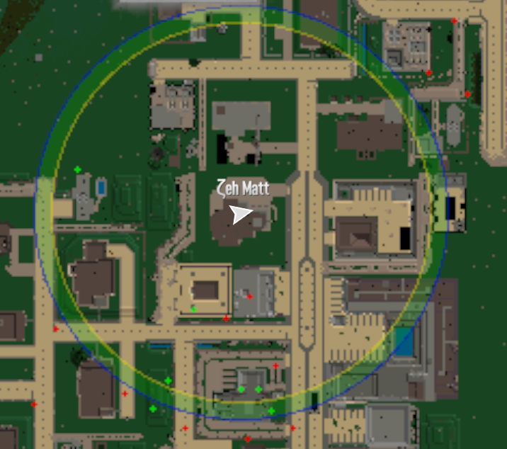

# Frequently Asked Questions

## Is This a Server Mod?

Yes. The mod runs on the server side. This means:

- Install it on servers
- Players joining don't need to install anything

## Will this influence the game performance/FPS?

No. The simulation runs in the background and is quite well optimized, you should not notice any difference.

## When I host this on a server will the clients need the mod?

No. Only the server needs the mod.

## When Do Zombies Appear?

When you get close to a virtual zombie, it appears in your game as a real zombie you can see and fight.

<figure markdown="1">

</figure>

The picture above shows how this works. Virtual zombies walk around in a circle around you. When they cross into the colored ring near the edge, they become real zombies in your game.

The zombie that appears matches your area:

- Desert zombies in the desert
- Snow zombies in the snow
- Uses the game's normal zombie spawn rules

!!! note "Important"
    There is no guarantee that zombies will spawn when they enter the activation zone. If the virtual zombie's location is inside a POI or otherwise obstructed, the spawn will not occur and the zombie will continue advancing in the simulation as a virtual agent.

## When Do Zombies Disappear?

When zombies walk too far away from you, they turn back into virtual zombies. The mod remembers:

- How much health they had
- What type of zombie they were

So if that same zombie comes back later, it will still be hurt if you damaged it before.

## When Do Zombies Respawn?

Zombies only respawn when they are killed. When a zombie dies, it is returned to the simulation as a new virtual agent. This does not mean a zombie will immediately appear in the game world — the virtual agent must first move into a player's activation zone before it becomes a real zombie again.

## Where Do Zombies Respawn?

When a zombie is killed, where the new virtual agent is placed in the simulation depends on the configuration, see [AgentRespawnPosition](configuring/configuration/base.md#agentrespawnposition). From there, the agent moves through the simulation like any other virtual zombie until it enters a player's activation zone.

## Will I Have to Keep the Editor Running?

No. The Editor is a tool to help create a configuration and export it to the xml.

## How Is This Different from Vanilla?

In vanilla, zombies spawn randomly near players with no persistence. With WalkerSim, thousands of virtual zombies move around the entire map at all times. They only become real when they get close to a player. If a zombie despawns because you walked away, it continues moving in the simulation — it's still the same zombie. This creates a world that feels more alive and reactive, with emergent hordes and consequences for making noise.

## What About Wandering Hordes and Screamers?

WalkerSim entirely replaces vanilla wandering hordes. Mods that change vanilla wandering hordes (such as Improved Hordes) will have no effect. Screamers are unaffected — they still spawn from heat activity as normal.

## How Do I Adjust the Number of Zombies?

Adjust the [PopulationDensity](configuring/configuration/base.md#populationdensity) setting in the configuration. Higher values mean more virtual zombies in the simulation, lower values mean fewer.

## How Does the Population Ramp Work?

The population ramp is controlled by two settings: [PopulationStartPercent](configuring/configuration/base.md#populationstartpercent) and [FullPopulationAtDay](configuring/configuration/base.md#fullpopulationatday).

`PopulationStartPercent` controls what percentage of zombies are active on day 1 — the rest are dormant. `FullPopulationAtDay` sets the day by which the population reaches 100%. The population scales linearly between those two values.

In the default configuration, `PopulationStartPercent` is set to 10 and `FullPopulationAtDay` is set to 8. This means you start with only 10% of zombies on day 1, ramping up to full population by day 8. These values are config-specific and can be changed in the XML to suit your preference.

## Do I Need the Editor to Run the Mod?

No. The Editor is a separate optional tool for creating and editing configurations visually. You do not need to install or run the Editor on your server or client. You can also edit the XML configuration with any text editor.

## Can I Update to a New Version on an Existing Save?

Yes. You can install a new version on an existing save. However, the simulation state will restart because the saved state format may be incompatible between major versions. Your game save itself is not affected.

## Does This Work on Large Maps?

Maps up to 10k are supported. Maps larger than 10k (such as 16k) are not officially supported and may cause errors on startup.

## Does This Affect NPCs?

No. WalkerSim only manages zombie spawning. NPC spawning from other mods should not be affected.

## Do Land Claim Blocks Prevent Zombie Spawns?

No. Land claim blocks do not prevent WalkerSim spawns. Bedrolls prevent spawning near your sleeping area. This is consistent with base game behavior.

## I'm Not Seeing Biome-Specific Zombies (Burnt, Desert, Snow)

This has been fixed. Earlier versions had an issue where biome-specific zombies spawned too rarely due to how "none" entries in the base game's entitygroups.xml were handled. If you are experiencing this, update to the latest version.

## I'm Not Seeing Irradiated or Charged Zombies

The base game does not use gamestage for biome zombie spawns. Irradiated and charged variants are primarily tied to specific POIs and biome spawn rules, not player gamestage. This is base game behavior, not a WalkerSim limitation.

## Does This Change Animals?

No. Animals work exactly the same as in the normal game.

## What About Blood Moon?

You can choose in the settings. By default, the mod stops during Blood Moon nights so the normal Blood Moon zombies work as usual, see [PauseDuringBloodmoon](configuring/configuration/base.md#pauseduringbloodmoon).
